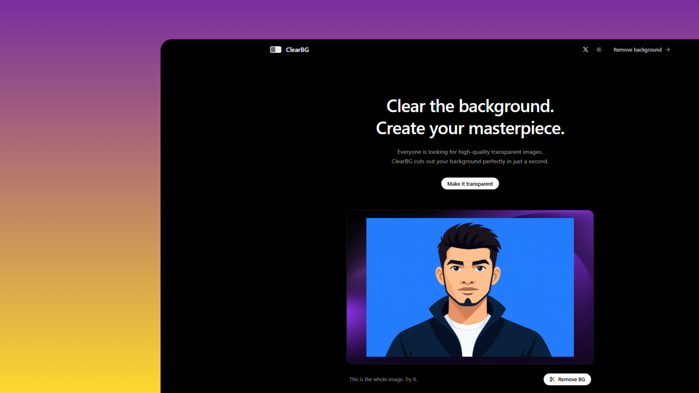

# ClearBG - AI Bg Removeing tool



**ClearBG** is a highly-focused web application that does one thing exceptionally well: instantly removing the background from any image with AI precision. You simply upload a photo, and the app instantly detects the main subject, strips away the background, and delivers a clean, transparent cutout ready for use.

**How ClearBG stands out from other platforms:**
While many background removal tools restrict basic functionality behind paywalls or clutter the UI with intrusive ads, **ClearBG** offers a premium, distraction-free experience with unique technical advantages:

- **Free & Open Source**: No hidden fees, no subscriptions, and no paywalls. ClearBG is entirely free and open-source, allowing anyone to use it or deploy their own instance.
- **No Login Required**: Jump straight into the action. There's no need to create an account, hand over your email, or jump through hoops just to remove a background.
- **Unrestricted High-Quality Downloads**: While most commercial tools charge a premium for HD or full-resolution exports, ClearBG lets you download your transparent PNGs in absolute High Quality for completely free.
- **Zero-Latency Quality Scaling**: Unlike standard tools that re-process the image on the server every time you change download settings, ClearBG uniquely leverages the client-side **HTML5 Canvas API**. This means you can dynamically change your export quality (Low, Medium, High) instantly without waiting for extra network requests.
- **Privacy-First Processing**: Your images are processed securely and are never stored permanently on our servers, ensuring complete privacy.

## Key Features

- **AI Background Removal**: Automatically detect and precisely remove image backgrounds using integration with industry-standard AI tools.
- **Interactive Comparison Slider**: A beautifully crafted before/after slider that lets users compare the original and processed images seamlessly, complete with custom SVG slider handles.
- **Dynamic Download Quality**: Users have the power to select their preferred export quality (`Low`, `Medium`, `High`). The app leverages HTML5 `<canvas>` to resize the image on the client-side before downloading, optimizing bandwidth and storage.
- **Premium Glassmorphic UI**: Built with Tailwind CSS and Framer Motion, featuring smooth transitions, micro-interactions, and a sleek, frosted-glass aesthetic inspired by top-tier SaaS platforms.
- **Dark & Light Mode Integration**: Full theme support that automatically adapts to the user's system preferences, including thoughtfully styled custom SVG icons that invert perfectly on theme switch.
- **Custom SVG Iconography**: Migrated from standard icon libraries to bespoke, scalable SVG icons across the UI (e.g., Theme Toggle, Upload Zone, Result Actions) for a unique brand identity.
- **Privacy-First Architecture**: Uploaded files are processed securely in memory and deleted immediately after use. No permanent storage ensures complete user privacy.
- **Robust Error Handling & Validation**: Comprehensive client and server-side validation for file types and sizes (<10MB), ensuring a resilient user experience.

## Tech Stack

### Frontend

- **React**: Component-based UI library.
- **TypeScript**: Static typing for robust code.
- **Vite**: Ultra-fast build tool and development server.
- **Tailwind CSS**: Utility-first CSS framework for custom, responsive styling.
- **Framer Motion**: Production-ready animation library for smooth UI transitions.
- **HTML5 Canvas API**: Used for client-side image resizing and quality optimization before download.
- **Custom SVGs & Lucide React**: A mix of bespoke custom SVG iconography and Lucide React for consistent UI elements.

### Backend

- **Node.js & Express**: Fast, unopinionated backend server.
- **TypeScript**: Type safety across the full stack.
- **Multer**: Middleware for handling `multipart/form-data` and secure file uploads.
- **Axios**: Promise-based HTTP client for external API communication.

## Architecture

The project is structured into two main parts:

- `frontend/`: The React application
- `server/`: The Express backend API

The background removal service uses the `remove.bg` API by default (configurable). If no API key is provided, it falls back to a MockProvider (which returns the original image after a delay to simulate processing).

## Prerequisites

- Node.js (v18+)
- npm

## Installation & Setup

1. **Clone the repository** (if applicable) and navigate to the root directory.

2. **Setup the Backend Server**:

   ```bash
   cd server
   npm install
   ```

3. **Configure Environment Variables**:
   In the `server` directory, create a `.env` file based on `.env.example`:

   ```bash
   cp .env.example .env
   ```

   Add your `remove.bg` API key to `BACKGROUND_REMOVAL_API_KEY` to use real AI processing.

   ```env
   BACKGROUND_REMOVAL_API_KEY=your_api_key_here
   PORT=5000
   ```

4. **Setup the Frontend**:
   ```bash
   cd ../frontend
   npm install
   ```

## Development

You will need two terminal windows to run both the frontend and backend simultaneously.

**Terminal 1 (Backend)**:

```bash
cd server
npm run dev
```

_Runs the Express server with auto-reloading on port 5000._

**Terminal 2 (Frontend)**:

```bash
cd frontend
npm run dev
```

_Runs the Vite development server on port 5173._

Open `http://localhost:5173` in your browser.

## Production Build

### Backend

```bash
cd server
npm run build
npm start
```

### Frontend

```bash
cd frontend
npm run build
```

## API Documentation

### `POST /api/remove-background`

Accepts a `multipart/form-data` request with an image file.

**Request**:

- `image`: The image file (PNG, JPG, WEBP). Max size: 10MB.

**Success Response** (200):

```json
{
  "success": true,
  "image": "data:image/png;base64,..."
}
```

**Error Response** (400/500):

```json
{
  "success": false,
  "message": "Error message description"
}
```

## Security Considerations

- **CORS**: Configure CORS in `server/src/app.ts` to only allow specific origins in production.
- **Rate Limiting**: Can be easily added to the Express server using `express-rate-limit`.
- **API Keys**: Never expose the `BACKGROUND_REMOVAL_API_KEY` to the frontend. All third-party calls are made from the backend.
- **File Validation**: Files are checked for size (<10MB) and mime-type on both the frontend and backend. Temporary files are deleted immediately after processing or on error.

## Reflections & Learnings

Building **ClearBG** was an exercise in balancing aesthetic design with high-performance utility. Some key takeaways from the development process include:

- **Client-Side Image Manipulation**: Implementing the dynamic download quality feature required deep diving into the HTML5 Canvas API. Learning how to cleanly draw and resize images in the browser before triggering a download was a significant technical milestone, eliminating the need for extra server round-trips.
- **State-Driven UI & Animations**: Integrating `framer-motion` for complex UI states (like the layout-shared active pill in the quality selector) elevated the user experience from a standard web app to a native-feeling application.
- **Iconography & Theming**: Moving away from generic icon libraries to custom SVG components highlighted the importance of accessible and theme-aware design. Ensuring paths inherited `currentColor` properly was crucial for maintaining visibility across Dark and Light modes.
- **Full-Stack Synergy**: Keeping the frontend lean while offloading the heavy AI processing to an Express backend demonstrated the importance of separation of concerns. The use of Multer for safe, temporary file handling on the server ensured the architecture remained secure and scalable.

**Powered by - remove.bg**

**Developed by** - [codewithdhruba](https://codewithdhruba.in/)
